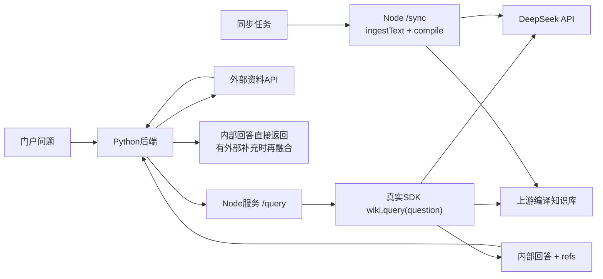

# llm-wiki-compiler + DeepSeek 试接

当前版本真正安装并调用`llm-wiki-compiler@1.3.0`，通过独立Node服务接入Python门户。此前自写的编译器保留为`KNOWLEDGE_BACKEND=local`，新分支使用`KNOWLEDGE_BACKEND=compiler`，两者数据目录分开。

上游：[atomicstrata/llm-wiki-compiler](https://github.com/atomicstrata/llm-wiki-compiler)。查阅源码提交：`e03e4cb5c4d85156c1d6213e48fcdb485d0dfdd6`。实际依赖通过npm锁定为1.3.0，依赖锁文件位于`compiler-service/package-lock.json`，未把上游源码复制为本项目实现。

## 当前验证结果和边界

- Node.js 24.16.0、真实npm包已在Windows加载成功。
- 2026-09-17，8篇虚构Wiki通过上游`ingestText()`导入后，已使用真实DeepSeek API完成编译：`compiled=8`、59个知识页、0个编译错误。
- 测试直接运行上游SDK的`query()`，用本地模拟模型端点验证请求格式、选页工具调用、答案与引用返回。这是协议测试，不是DeepSeek联网效果验证。
- 本机密钥已配置，真实内部问答与外部资料融合问答均通过：分别约5.3秒和7.9秒，返回5条和7条资料引用，链接均可打开，反馈保存成功。实际记录在Git忽略目录`data/live-validation.json`。这些只是两次功能联调结果，不代表完整效果评测或并发性能承诺。
- 回答能够说明演示资料的虚构性质及缺少真实收益数据。知识页和回答仍可能扩写原文，尚未逐句人工核验其语义支持关系；引用可打开不等于每个结论已验证。
- Linux Compose文件已提供，尚未进行Linux或ARM64实机验证。

## 架构



SDK实际签名是`wiki.query(question, {save:false})`。返回包含`answer`、`selectedPages`、`pageIds`和`refs`，不是直接假设存在`pages`字段。桥接服务再调用`getPage()`取得页面标题和内容。

上游回答使用`[[页面标题]]`引用；直接返回时保留该格式，附选中知识页列表，不把知识页冒充原始资料。融合回答使用门户编号引用。当前尚未把上游每条脚注映射为源Wiki章节链接，需查看知识页中的出处。

## DeepSeek配置

本地`.env`已切换为以下试接配置。本机密钥已填写；在新环境需要填写自己的密钥：

```dotenv
KNOWLEDGE_BACKEND=compiler
COMPILER_URL=http://127.0.0.1:8010
DEEPSEEK_API_KEY=填写自己的密钥
DEEPSEEK_BASE_URL=https://api.deepseek.com
DEEPSEEK_MODEL=deepseek-v4-flash
MODEL_MODE=openai
MODEL_URL=https://api.deepseek.com/chat/completions
MODEL_NAME=deepseek-v4-flash
```

密钥只写本地`.env`，它已被Git忽略。Node服务将DeepSeek参数映射到上游的OpenAI兼容提供方配置；Python融合调用在`MODEL_API_KEY`为空时复用`DEEPSEEK_API_KEY`。不使用机器上其他OpenAI密钥。

按DeepSeek截至2026-09-17的[官方文档](https://api-docs.deepseek.com/zh-cn/)，`deepseek-v4-flash`仍接受调用，但实际已由V4.1 Flash承接。因此保留该名称不代表锁定旧版模型权重。若要跟随官方当前名称，可改成`deepseek-flash`，并同步修改`MODEL_NAME`。

初版关闭thinking模式，编译使用`embeddings:false`，不把DeepSeek对话接口当作embedding服务。无向量索引时，上游query可能调用模型选页，再调用模型回答；一次用户问题可能产生多次模型请求。

## Windows运行

在根目录的第一个终端运行compiler服务：

```powershell
cd compiler-service
../.tools/node-v24.16.0-win-x64/node.exe --env-file-if-exists=../.env server.mjs
```

在根目录的第二个终端运行首次编译（需先填Key并重启compiler）：

```powershell
.venv/Scripts/python.exe -m app.sync --once
```

编译可能持续数分钟。成功后在根目录运行门户：

```powershell
.venv/Scripts/python.exe -m uvicorn app.main:app --host 127.0.0.1 --port 8000
```

访问`http://127.0.0.1:8000`，先不勾选外部资料，验证纯内部query。默认已将外部资料开关关闭，避免模拟外部资料干扰试接。

目录`data/upstream-compiler/`属于上游工具；不要把旧`data/vault/`导出的自写页面放进去冒充上游编译结果。`/wiki`在compiler模式下读取真实上游页面列表，编译前列表为空。

单独测试无模型导入可在`compiler-service`目录运行`node --env-file-if-exists=../.env ingest.mjs --no-compile`。此操作不生成知识页，也不能证明query可回答。

## Linux部署

```sh
docker compose -f compose.yaml -f compose.compiler.yaml up -d --build
```

新增compiler容器及独立数据卷，Node接口只对Compose内部网络开放，不额外发布8010端口。`web`和`sync`使用`http://compiler:8010`调用它。首次模型编译由同步任务执行。

## 试接限制

- 桥接服务串行执行编译或查询，忙时返回409；适合验证SDK，不是200人并发使用的最终方案。
- 入库目前使用完整快照；已知来源通过哈希跳过，无模型凭据时默认同步直接报错，不标记编译成功。
- 上游保存来源变更与编译日志，本分支未实现不可变版本原子切换。编译失败需重试并检查上游日志，不套用旧自写编译器的事务发布保证。
- Python请求超时不保证取消Node内已经开始的模型操作。单次模型超时设为90秒，整体首次同步等待上限900秒；需观察真实运行耗时再调整。
- 上游`query(save:false)`不保存答案页，但仍会追加查询日志；不把它描述为完全只读。
- 上游引用解析和语义支持、源Wiki链接映射、多用户并发仍需后续验证。

## 测试

```powershell
.venv/Scripts/python.exe -m pytest -q
cd compiler-service
../.tools/node-v24.16.0-win-x64/node.exe --test test/*.test.mjs
```

当前27项Python测试和4项Node测试通过。模拟端点只在自动测试中启动；实际服务没有模拟模型回退。Node测试额外验证上游返回非空`errors`时不会误报同步成功。
