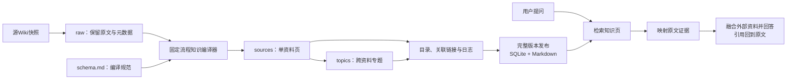

# Karpathy LLM Wiki：本项目实现

来源是[Karpathy的原始Gist](https://gist.github.com/karpathy/442a6bf555914893e9891c11519de94f)，不是同名桌面软件或可安装的解析SDK。原文提出用LLM把原始资料组织为持久化、关联的知识页。本项目据此实现编译层，未安装或复制第三方同名应用。

查阅版本：`ac46de1ad27f92b28ac95459c782c07f6b8c964a`。本地参考文件位于忽略Git的`.tools/karpathy-reference/llm-wiki.md`。此前架构中“待接入llm-wiki库”的表述已修正。

## 本项目的处理流程



知识编译属于派生数据构建：不会修改源Wiki，不会触发负责人提醒、质量巡检或自动评论。在线问答仍是固定流程，不使用自主Agent，也不将答案自动写回知识页。

## 两种编译模式

| 配置 | 行为 | 用途 |
| --- | --- | --- |
| `COMPILE_MODE=extractive` | 保存原文摘录、生成主题目录及关联链接，明确标注非模型综合 | 无密钥的本地演示 |
| `COMPILE_MODE=llm` | 调用模型生成单资料摘要，再生成同主题综合页，要求来源ID引用 | 配置真实模型后使用 |

默认8篇虚构原文生成8篇资料页、5篇主题页。主题页每组最多8篇原文，避免将整库一次塞入模型；组数超过上限时分成多页。未实现跨所有主题的任意知识图谱或全库推理。

模型编译每个变更页面使用一次受约束的JSON输出请求，顺序构建资料页与主题页。第一次启用模型会重建全部页面；后续复用内容依赖、模型配置与编译规范指纹未变化的页面。专题依赖相应资料页，源文档删除后不会继续出现在新发布知识页中。

## 数据布局

```text
data/
├── wiki.sqlite3                 # 活跃知识页、原文、同步状态、问答与反馈
└── vault/generations/<版本ID>/
    ├── schema.md               # 编译规则
    ├── manifest.json           # 页面、依赖与版本信息
    ├── raw/
    │   ├── <文档ID>.md         # 原文快照
    │   └── <文档ID>.json       # 原文链接、版本等元数据
    └── wiki/
        ├── index.md            # 可浏览的知识目录
        ├── log.md              # 延续前一版本的编译记录
        ├── sources/*.md        # 单资料页
        └── topics/*.md         # 主题页
```

每次发布使用新目录，历史原文不会被覆盖；没有内容变化时复用原版本。所有Markdown文件写完后，在同一个SQLite事务发布原文、知识页与活跃版本指针。编译失败保留上一个可用版本。数据库中的`compilation.generation`是活跃版本依据，不能只按磁盘目录时间选择。

当前历史版本与问答记录没有自动清理；实际部署需确定保留周期。未发布的孤立目录不参与查询，清理前需先确认不是活跃版本。

## 查询与引用

查询先匹配知识页，再通过`source_ids`定位原文片段；知识页内容作为派生上下文辅助模型理解。返回的引用仍链接原文，界面另提供“查看关联知识页”。

本地排序目前采用轻量关键词匹配，中文使用二元词；没有引入向量库或重排模型。当前优先保持原文可追溯，不声称已具备语义检索质量。原文片段无法匹配时，不仅凭生成的知识页给出已验证结论。

编译器检查输出结构、长度和来源ID范围；在线回答检查引用编号。它们只能防止格式错误与不存在的引用，不能证明每句话被原文支持，真实模型的内容质量仍需观察。

## 开发位置

- `app/compiler.py`：知识页生成、依赖缓存、Markdown导出。
- `app/sync.py`：拉取快照、调用编译、事务发布。
- `app/retrieval.py`：知识页检索与原文证据解析。
- `/wiki`、`/api/wiki`：知识目录页面和数据接口。
- `tests/test_compiler.py`：版本复用、依赖更新、删除、编译失败保留与来源验证。

Windows与Linux共用Python实现，未新增桌面运行时或常驻Agent依赖。模型接入和启动方式见[运行说明](running.md)。
